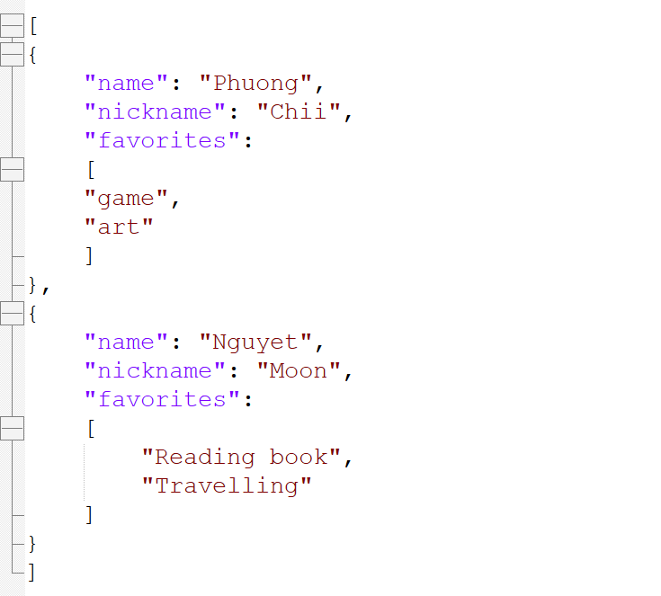

# API 

## API là gì?
### Khái niệm
**API (Application Programing Interface)** là một bộ các quy tắc giúp các phần mềm có thể tương tác với nhau.

### Lịch sử 
API xuất hiện vào những năm 1960 khi mà các phần mềm cần có phương thức để có thể giao tiếp với nhau.

Thuật ngữ API trở nên phổ biến vào những năm 1990 khi mà các web phát triển, cho phép các ứng dụng khác nhau giao tiếp với nhau qua internet.

### Lợi ích của API
API giúp các phần mềm trong hệ thống  giao tiếp được với nhau, giúp quá trình phát triển phần mềm độc lập và nhanh chóng hơn. 

Việc xây dựng phần mềm bằng API có thể ví như việc lắp ghép Lego. Các phần trong hệ thống được xây dựng riêng như là các mảnh lego và sử dụng gọi API tích hợp lại như một cách ghép hình.

## Tại sao cần test bằng API?

- **Việc test API sẽ đảm bảo dữ liệu của hệ thống hoạt động đúng với mong đợi.** Nó cũng đảm bảo API thực hiện chức năng tương tác giữa các phần của hệ thống đúng và đáng tin cậy.
- **Test API giúp phát hiện lỗi sớm.** Giúp cho việc xử lí lỗi được thực hiện ở các phần riêng lẻ luôn trước khi tích hợp, đồng thời giảm tải việc sử lí bug xảy ra sau khi đã triển khai hệ thống.
- **Đảm bảo hiệu năng.** Việc test API đảm bảo việc phần mềm hoạt động nhanh chóng và ổn định trong mọi điều kiện tải, giúp nâng cao trải nghiệm của người dùng.
- **Kiểm tra tính bảo mật.** Giúp xác minh các lỗ hổng bảo mật trong API, tránh các nguy cơ bị lộ những dữ liệu nhạy cảm cũng như các cuộc tấn công tiềm ẩn.

## Các hình thức test API phổ biến 
### Functional testing (Kiểm thử chức năng)
Phương pháp này giúp kiểm thử chức năng chính của hệ thống, đảm bảo API hoạt động đúng và kết quả như mong đợi.
### Load testing (Kiểm thử tải)
Phương pháp này giúp kiểm tra hiệu năng và khả năng chịu tải của API khi có một lượng lớn yêu cầu cần xử lí trong khi tải.
### Sercurity testing (Kiểm thử bảo mật) 
Phương pháp này giúp kiểm tra các lỗ hổng bảo mật trong API.
### Intergration testing (Kiểm thử tích hợp)
Phương pháp này giúp API hoạt động tốt trước khi tích hợp với các hệ thống khác.

## Các loại API phổ biến
### Web APIs 
1. **REST API**
-  Sử dụng các phương thức HTTP (GET,POST, PUT, DELETE)
- Đơn giản, dễ sử dụng và khả năng dễ mở rộng cao nên rất phổ biến hiện nay
2. **SOAP API**
- Sử dụng giao thức XML
- Được sử dụng chủ yếu trong các hệ thống enterprise cần tính bảo mật và độ tin cậy cao, điển hình là ngân hàng.
3. **GraphQL**
- Là ngôn ngữ do Facebook phát triển năm 2012
- Là ngôn ngữ truy vấn, với cấu trúc query cho phép lấy chính xác những dữ liệu cần.
- Tối ưu hóa dữ liệu sử dụng, mang lại sự linh hoạt và hiệu quả hơn trong việc truy vấn và thao tác dữ liệu từ server.

### Library/Framework APIs
Cho phép lập trình viên sử dụng các nền tảng, chức năng có sẵn như Java API, .NET Framework API, React API..
### Operating System APIs
Cho phép ứng dụng tương tác với hệ điều hành. VD: Windows API, Linux Kernel API..
### Hardware APIs
Cho phép phần mềm giao tiếp với phần cứng. VD: Camera API, Printer API, USB API..

## Công cụ API phổ biến
### Test API manual
- **cURL**
- **Postman**
- IntelliJ IDE
- Jmeter
- SOAP UI
### Test API automation
- **Playwright**
- RestAssured
- Cypress
- Karate
- Katalon
- Selenium
- WebdriverIO

# XML
## XML là gì?
### Khái niệm
**XML (eXtensible Markup Language)** là "ngôn ngữ đánh dấu" để mô tả nội dung tài liệu một cách có hệ thống thông qua các thẻ quy định kiểu dữ liệu do người sử dụng tự định nghĩa.

Là chuẩn được W3 gợi ý dùng.

Ví dụ:

# JSON
## JSON là gì?
### Khái niệm
**JSON (JavaScript Object
Notation)** là một định dạng text, dùng format của Javascript Object và được sử dụng để trao đổi dữ liệu giữa máy chủ và ứng dụng web.

JSON có chức năng tương tự như XML, nhưng nhẹ hơn XML.

JSON không bị phụ thuộc vào ngôn ngữ lập trình 

JSON có thể tự định nghĩa quy cách kiểu dữ liệu thông qua các key-value.

Format:

    “key”: “value”

Ví dụ:
