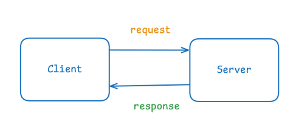
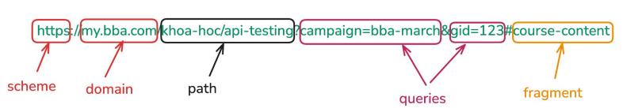
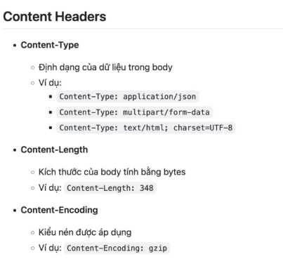
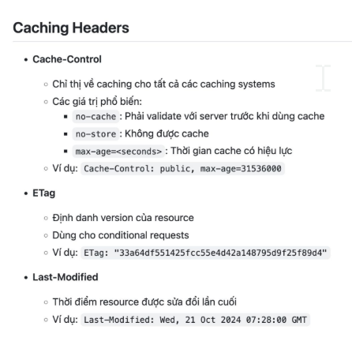
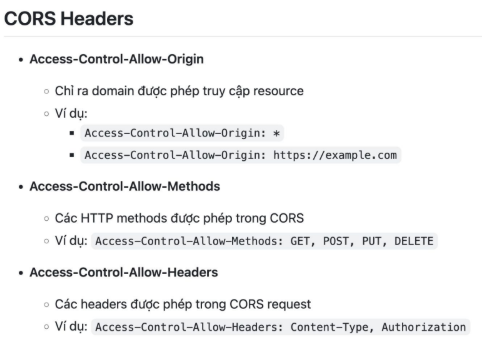
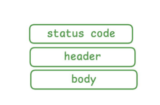

# REST API

## Mô hình tổng quan

Client gửi một yêu cầu đến server bằng API, server sẽ xử lí yêu cầu đó và phản hồi lại về cho client.

Trong một yêu cầu của client gửi đến server sẽ bao gồm **method, URL, header, body**.

Khi server phản hồi lại cho client qua hệ thống sẽ có cấu trúc bao gồm các phần **status code, header, body**.
### Tại sao phải tách ra nhiều thành phần?
1.  Giúp việc gửi - nhận dữ liệu hiệu quả hơn 
- Việc chia thành nhiều phần giúp kích thước của request nhỏ hơn => Hiêu quả hơn, tiết kiệm thời gian và tài nguyên khi xử lí dữ liệu
- Server chỉ cần đọc dữ liệu từ client khi thật sự cần thiết. 
2. Rõ ràng về ý định

    Mỗi thành phần đã có vai trò cụ thể, điều này giúp cả client và server hiểu chính xác yêu cầu của từng phần là gì. Việc xử lí cũng sẽ nhanh gọn hơn thì mọi thứ đều rõ ràng.

3. Linh hoạt 

    Cho phép tái sử dụng và tùy chỉnh từng phần mà không làm rối toàn bộ server.

    Việc chia nhỏ ra thành từng phần và mỗi phần đều có định danh cụ thể khiến cả client và server có thể quyết định được phần nào là phần có thể giữ nguyên, phần nào có thể thay đổi. Và việc thay đổi từng phần lin hoạt như vậy sẽ không ảnh hưởng đến các phần còn lại.

## REQUEST
### Thành phần của request

1. **Request: Method** 

HTTP Method (hoặc HTTP Verb) là phương thức định nghĩa trong giao thức HTTP để chỉ ra hành động mà client muốn thực hiện với tài nguyên trên server.

Các method phổ biến:
- GET: Lấy dữ liệu
- POST: Tạo mới dữ liệu 
- PUSH: Cập nhật TOÀN BỘ dữ liệu
- PATCH: Cập nhật MỘT PHẦN dữ liệu
- DELETE: Xóa dữ liệu
- HEAD: Lấy metadata của resource
- OPTIONS: Lấy thông tin về methods

2. **Request: URL** 

URL (Uniform Resource Locator) là đường dẫn tới resource.

Ví dụ:

- scheme: giao thức được sử dụng để truy cập web
- domain: 
    - tên miền để xác định máy chủ trên internet

    - Cấu trúc thường bao gồm: 
    
      **subdomain.secondarydomain.topdomain** 
   
       VD: my.bba.com

- path: 
    - link đến dữ liệu con trong resource cụ thể trên web
    - đứng trước domain, theo sau bởi dấu /
- queries: 

    -  Là các tham số được truyền thêm để lọc, tìm kiếm hoặc xác định dữ liệu.
    - Bắt đầu bằng dấu ?, các cặp key=value ngăn cách bởi &
    
- fragment: 

    - Trỏ đến một phần cụ thể trong web (thường là một đoạn trong trang HTML)
    - Để cuộn đến đúng vị trí trong page content, không có tác dụng khi gửi lên server

3. **Request: Header**
- Header: là dữ liệu đi đầu trong mỗi request
- Là các cặp **key-value** trong request HTTP để truyền tải **thông tin bổ sung** giữa client và server.

Các nhóm headers:
- **Authorization headers**: Chuyên cho việc xác thực client 

- **Content headers**: khai báo kiểu dữ liệu mà client gửi lên

- **Caching headers**: liên quan đến bộ nhớ đệm (cache)

- **Security header**: liên quan đến bảo mật

- CORS headers: liên quan tới việc chia sẻ dữ liệu giữa các domain khác nhau 

4. **Request: Body**

Tại sao cần request body?
- **Tối ưu hoá giao tiếp**: Hiểu đúng cách truyền dữ liệu giúp giảm sai sót trong giao tiếp giữa client và server.
- **Tăng bảo mật**: Request body có thể chứa thông tin nhạy cảm (như mật khẩu), vì vậy cần mã hóa hoặc sử dụng HTTPS. Nếu để thông tin nhạy cảm ở URL, hacker có thể đọc được.
- **Tăng hiệu quả xử lý**: Xây dựng request body hợp lý giúp server xử lý nhanh hơn, tránh lỗi phát sinh.

Lưu ý khi làm việc với request body:
- Sử dụng đúng định dạng
- Xác thực dữ liệu 
- Mã hóa dữ liệu nhạy cảm 
- Kiểm tra lỗi từ server 

## RESPONSE
Thành phần response 

### Response: Status code
- Nhóm 1XX - Infomation
- Nhóm 2XX - Success
- Nhóm 3XX - Redirection
- Nhóm 4XX - CLient error
- Nhóm 5XX - Server error

### Respone: Header
- Là phần thông tin metadata được server gửi kèm trong response trả về cho client.
- Chứa các thông tin quan trọng về cách xử lý response, bảo mật, caching và nhiều thông số kỹ
thuật khác.
- Response headers được định dạng dưới dạng cặp key-value

    Ví dụ: Content-Type:
application/json.

**Tác dụng: đóng vai trò quan trọng trong việc giao tiếp giữa client với server**
- Cung cấp thông tin về nội dung response (kiểu dữ liệu, encoding, độ dài...)
- Kiểm soát caching để tối ưu hiệu năng
- Thiết lập các chính sách bảo mật
- Quản lý phiên làm việc và cookie
- Hướng dẫn browser cách xử lý dữ liệu nhận được
- Hỗ trợ cross-origin resource sharing (CORS)

### Respone: Body 
Response Body là phần nội dung chính của phản hồi (response) từ server khi client gửi một request. Đây là nơi chứa dữ liệu thực tế mà server trả về, có thể ở nhiều định dạng khác nhau như JSON, XML, HTML, văn bản thuần túy, hoặc dữ liệu nhị phân.

**Tác dụng:**
- Chứa thông tin chính mà client yêu cầu từ server
- Truyền tải dữ liệu giữa client và server một cách có cấu trúc
- Cho phép ứng dụng client xử lý và hiển thị thông tin cho người dùng
- Hỗ trợ việc giao tiếp bất đồng bộ giữa các hệ thống
- Cung cấp thông tin về trạng thái xử lý của request

**Test respone body thì test những gì:**
- Kiểm tra cấu trúc
- Kiểm tra nội dung
- Kiểm tra xử lí lỗi
- Kiểm tra hiệu năng

## Authentication & authorization

**Định nghĩa:**
- Authentication (xác thực) là quá trình xác minh danh tính của người dùng hoặc hệ thống.
- Authorization (phân quyền) là quá trình xác
định quyền truy cập của người dùng sau khi xác minh danh tính.

Mục đích sử dụng Authentication và Authorization để bảo vệ tài nguyên hệ thống, đảm bảo chỉ người dùng hợp lệ mới truy cập được dữ liệu hoặc chức năng phù
hợp với vai trò của họ.

## TERM
- Username, password: một cặp dùng để xác thực
người dùng.
- Session, cookie: Session-Cookie là một phương pháp
xác thực dựa trên trạng thái (stateful  uthentication), trong đó server duy trì trạng thái
đăng nhập của người dùng bằng session, còn client lưu session ID dưới dạng cookie

    - Session: lưu ở trên server
    - Cookie: lưu ở dưới máy tính của client
- Base64 encode/ decode: là việc biến đổi một chuỗi
gốc thành một chuỗi mã hoá theo thuật toán mã hóa Base64
- Token (hay Access Token): là một chuỗi ký tự ngẫu
nhiên dùng để xác thực người dùng hoặc ứng dụng.
    - Được tạo ra sau khi người dùng đăng nhập thành công
    - Thường có thời gian sử dụng ngắn hạn
    - Có thể chứa thông tin về user, quyền hạn, thời gian hết hạn
    - Các dạng token phổ biến:
        - Session Token (dùng trong session-cookie authentication).
        - Bearer Token (thường dùng trong OAuth 2.0).
        - JWT (JSON Web Token): Bearer token theo format **header.body.signature**
    - Cách dùng: đính kèm trong header hoặc query parameter
- Refresh Token là một loại token dùng để cấp mới
Access Token khi Access Token hết hạn, giúp người
dùng không phải đăng nhập lại.
- API Key là một chuỗi ký tự duy nhất được cấp cho ứng dụng hoặc người dùng để truy cập API:
    - API Key thường không thay đổi, chỉ xem được một lần saukhi tạo xong
    - Không chứa thông tin người dùng mà chỉ xác định ứng dụng nào đang gọi API.
    - Sử dụng tương tự token
    
    Cách dùng: đính kèm trong header hoặc query
parameter