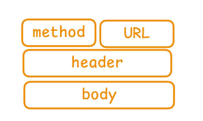
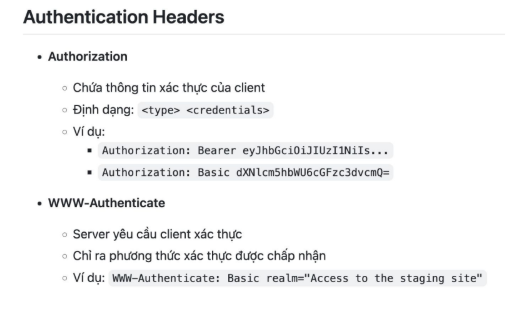
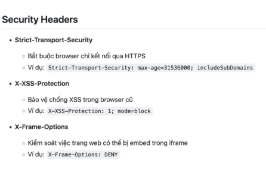

# REST API

## Mô hình tổng quan

Client gửi một yêu cầu đến server bằng API, server sẽ xử lí yêu cầu đó và phản hồi lại về cho client.

Trong một yêu cầu của client gửi đến server sẽ bao gồm **method, URL, header, body**.

Khi server phản hồi lại cho client qua hệ thống sẽ có cấu trúc bao gồm các phần **status code, header, body**.
### Tại sao phải tách ra nhiều thành phần?
1.  Giúp việc gửi - nhận dữ liệu hiệu quả hơn 
- Việc chia thành nhiều phần giúp kích thước của request nhỏ hơn => Hiêu quả hơn, tiết kiệm thời gian và tài nguyên khi xử lí dữ liệu
- Server chỉ cần đọc dữ liệu từ client khi thật sự cần thiết. 
2. Rõ ràng về ý định

    Mỗi thành phần đã có vai trò cụ thể, điều này giúp cả client và server hiểu chính xác yêu cầu của từng phần là gì. Việc xử lí cũng sẽ nhanh gọn hơn thì mọi thứ đều rõ ràng.

3. Linh hoạt 

    Cho phép tái sử dụng và tùy chỉnh từng phần mà không làm rối toàn bộ server.

    Việc chia nhỏ ra thành từng phần và mỗi phần đều có định danh cụ thể khiến cả client và server có thể quyết định được phần nào là phần có thể giữ nguyên, phần nào có thể thay đổi. Và việc thay đổi từng phần lin hoạt như vậy sẽ không ảnh hưởng đến các phần còn lại.

## REQUEST
### Thành phần của request

1. **Request: Method** 

HTTP Method (hoặc HTTP Verb) là phương thức định nghĩa trong giao thức HTTP để chỉ ra hành động mà client muốn thực hiện với tài nguyên trên server.

Các method phổ biến:
- GET: Lấy dữ liệu
- POST: Tạo mới dữ liệu 
- PUSH: Cập nhật TOÀN BỘ dữ liệu
- PATCH: Cập nhật MỘT PHẦN dữ liệu
- DELETE: Xóa dữ liệu
- HEAD: Lấy metadata của resource
- OPTIONS: Lấy thông tin về methods

2. **Request: URL** 

URL (Uniform Resource Locator) là đường dẫn tới resource.

Ví dụ:

- scheme: giao thức được sử dụng để truy cập web
- domain: 
    - tên miền để xác định máy chủ trên internet

    - Cấu trúc thường bao gồm: 
    
      **subdomain.secondarydomain.topdomain** 
   
       VD: my.bba.com

- path: 
    - link đến dữ liệu con trong resource cụ thể trên web
    - đứng trước domain, theo sau bởi dấu /
- queries: 

    -  Là các tham số được truyền thêm để lọc, tìm kiếm hoặc xác định dữ liệu.
    - Bắt đầu bằng dấu ?, các cặp key=value ngăn cách bởi &
    
- fragment: 

    - Trỏ đến một phần cụ thể trong web (thường là một đoạn trong trang HTML)
    - Để cuộn đến đúng vị trí trong page content, không có tác dụng khi gửi lên server

3. **Request: Header**
- Header: là dữ liệu đi đầu trong mỗi request
- Là các cặp **key-value** trong request HTTP để truyền tải **thông tin bổ sung** giữa client và server.

Các nhóm headers:
- **Authorization headers**: Chuyên cho việc xác thực client 

- **Content headers**: khai báo kiểu dữ liệu mà client gửi lên

- **Caching headers**: liên quan đến bộ nhớ đệm (cache)

- **Security header**: liên quan đến bảo mật

- CORS headers: liên quan tới việc chia sẻ dữ liệu giữa các domain khác nhau 

4. **Request: Body**
   